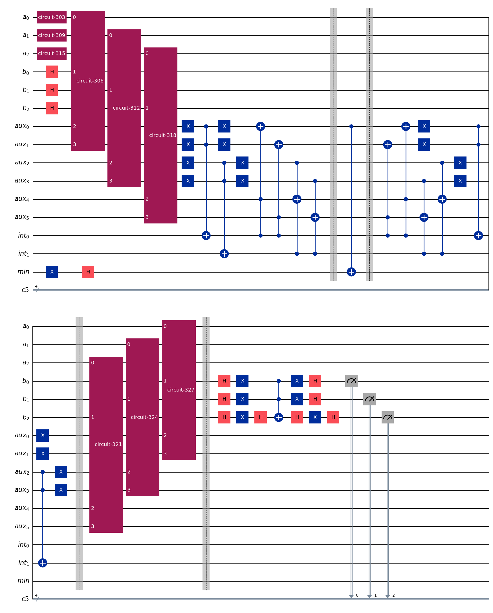

# quantumcomparison
Quantum bitstring comparison inside Grover's algorithm
Implementation if QBSC quantum bit string comparator into a Grover's algorithm. The circuit consist of a compartor implemented as an oracle in a grover circuit. The grover circuit uses a oracle for finding elements in a list that are smaller then a value k.

