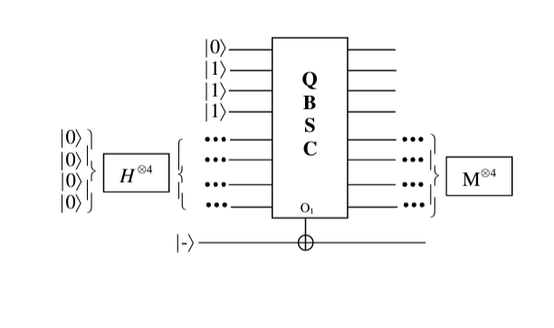

# quantumcomparison
Quantum bitstring comparison inside Grover's algorithm
Implementation if QBSC quantum bit string comparator into a Grover's algorithm. The circuit consist of a compartor implemented as an oracle in a grover circuit. The grover circuit uses a oracle for finding elements in a list that are smaller then a value k.
Overall circuit is give in the next figure:
\

\
**Oracle Design**
We wnat to do a task that is named "less than k". This means given a positive k and a list of integer numbers, look for the number within the list, that are less than K. We will start with a fixed list for the numbers from 0 to 8 and k can be chosen. Later we will use a arbitrary list.
Example A = less_than_k (k=3, [0,1,2,3,4,5,6,7])\
print(A)\
0,1,2\
\

