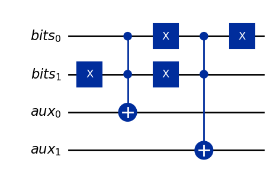
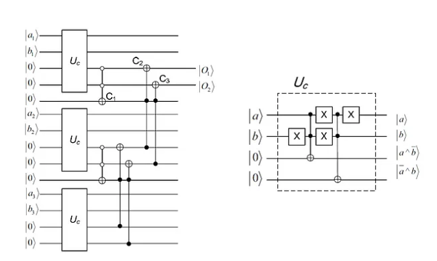

# quantumcomparison
Quantum bitstring comparison inside Grover's algorithm
Implementation of a  QBSC quantum bit string comparator into a Grover's algorithm. The circuit consist of a compartor implemented as an oracle in a grover circuit. The grover circuit uses a oracle for finding elements in a list that are smaller then a value k.
Overall circuit is give in the next figure:
\

\
**Oracle Design**
We wantt to do a task that is named "less than k". This means given a positive k and a list of integer numbers, look for the number within the list, that are less than K. We will start with a fixed list for the numbers from 0 to 8 and k can be chosen. Later we will use a arbitrary list\
Example A = less_than_k (k=3, [0,1,2,3,4,5,6,7])\
print(A)\
0,1,2

The comparotor compares two integers and is build around a bitcompare circuit. The compare circuit compare two qubits for the two one-digit binary numbers\

\
We can simulate this circuit with two inputs a an b\
The output will be 00 if a = b\
The output will be 01 if a > b\
The output will be 10 if a < b

With a number of bitcompare circuits combined we have a bitstring comparator. We can find the biggest number of two integers with teh bitstring compare. Therefore we have to encode the integers numbers as a bitstring\

\

The next step is to implement the bitstringcompartor in a grover algorithm. The grover circuit has two inputs. One for setting k the number that gives teh upper boundary, we want answers less than K. And the other input is connected to a number generator in superposition. In the next figure, it is connected to b0,b1,b2 and has 3 hadamrds gate. The result is a list of numbers for 0 to 7. 

The bit compartor is simulated with the file compare_1.pynd\
The bitstring compartor is simulated and tested in compare_2.ipynd\
The overall grover algorithm for findig numbers lower than k in a list is given in compare_3.ipynd.

